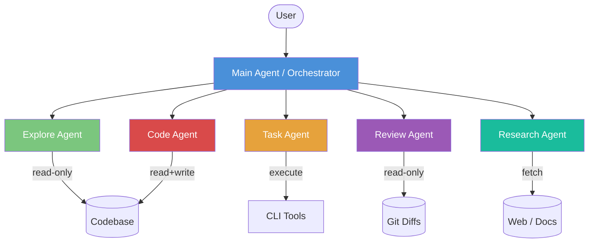
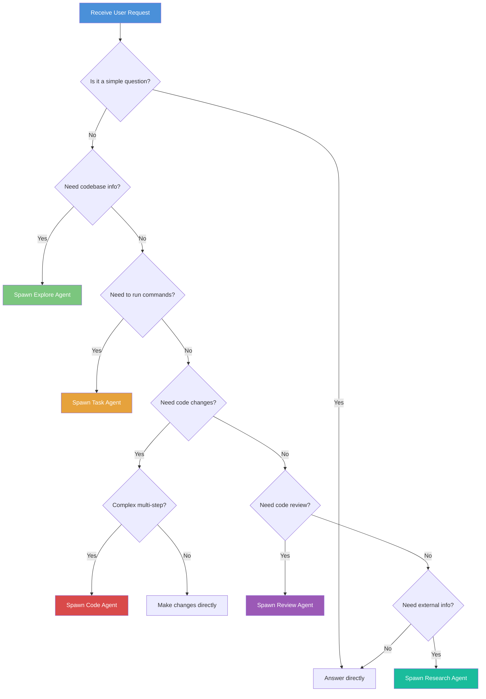
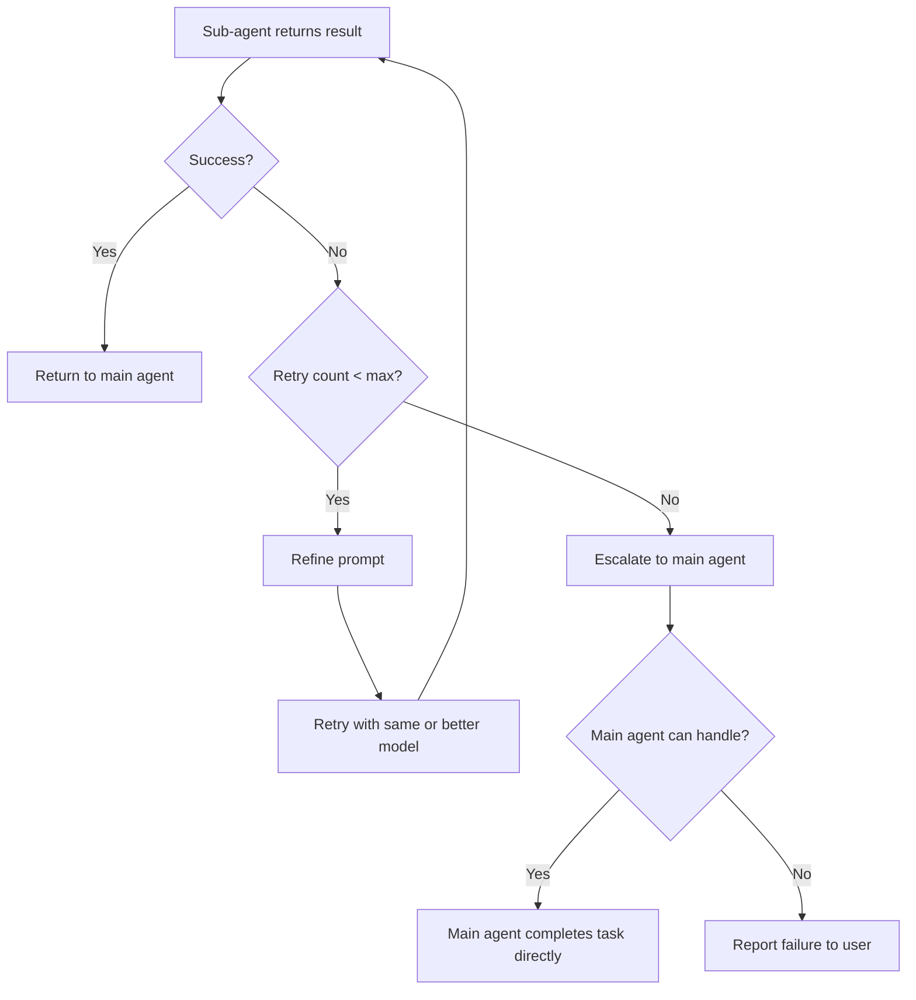

# Sub-Agent Delegation Architecture

> Design document for FridayCode's multi-agent orchestration system.

## Overview

FridayCode's main agent serves as an **orchestrator** that delegates complex tasks to specialized sub-agents. Rather than handling everything in a single context window, the main agent analyzes incoming tasks, determines complexity, and spawns purpose-built sub-agents optimized for specific workloads.

This architecture provides:

- **Better resource utilization** — cheap/fast models for simple tasks, powerful models only when needed
- **Context isolation** — sub-agents operate in fresh context windows, preventing conversation history leakage
- **Parallelism** — read-only agents can safely run in parallel, dramatically improving throughput
- **Reliability** — failures are contained to individual sub-agents and can be retried without losing main context



---

## Agent Types

### Explore Agent

Fast, read-only codebase exploration. Optimized for answering questions about code structure, finding files, and tracing relationships.

| Property            | Value                                      |
| ------------------- | ------------------------------------------ |
| **Model Tier**      | Fast / Cheap (e.g., Haiku, GPT-4.1-mini)   |
| **Tools Available** | `grep`, `glob`, `view`, `bash` (read-only) |
| **Side Effects**    | None — purely read-only                    |
| **Parallelizable**  | ✅ Yes — safe to run many in parallel      |
| **Typical Latency** | 2–10 seconds                               |

**Use Cases:**

- "Where is authentication implemented?"
- "Find all files matching `**/*.test.ts`"
- "How does the router handle middleware?"
- Multi-part codebase questions requiring synthesis across files

**Key Behavior:**

- Stateless — loses all context between calls
- Batch related questions into a single call to minimize round-trips
- Returns summarized answers, not raw search results

### Task Agent

Executes shell commands with smart output handling. Returns brief summaries on success, full output on failure.

| Property            | Value                                                  |
| ------------------- | ------------------------------------------------------ |
| **Model Tier**      | Fast / Cheap (e.g., Haiku, GPT-4.1-mini)               |
| **Tools Available** | All CLI tools (`bash`, `npm`, `cargo`, etc.)           |
| **Side Effects**    | ✅ Yes — runs builds, tests, installs                  |
| **Parallelizable**  | ⚠️ Limited — sequential for commands with shared state |
| **Typical Latency** | 5–120 seconds (depends on command)                     |

**Use Cases:**

- Running test suites: "Run `npm test` and report results"
- Building projects: "Run `cargo build --release`"
- Installing dependencies: "Install missing packages"
- Linting: "Run ESLint on the `src/` directory"

**Key Behavior:**

- On success: returns a brief summary (e.g., "All 247 tests passed")
- On failure: returns full output including stack traces and compiler errors
- Keeps main context clean by summarizing verbose command output

### Code Agent

Full-capability agent for complex, multi-step code changes. Runs in an isolated context with the complete toolset and high-quality reasoning.

| Property            | Value                                                        |
| ------------------- | ------------------------------------------------------------ |
| **Model Tier**      | Powerful (e.g., Sonnet, GPT-5)                               |
| **Tools Available** | All tools — `bash`, `view`, `edit`, `create`, `grep`, `glob` |
| **Side Effects**    | ✅ Yes — creates and modifies files                          |
| **Parallelizable**  | ❌ No — must run sequentially (file system mutations)        |
| **Typical Latency** | 10–300 seconds                                               |

**Use Cases:**

- Implementing a new feature across multiple files
- Refactoring a module with many interdependencies
- Fixing a complex bug that requires investigation + code changes
- Migrating code from one pattern to another

**Key Behavior:**

- Receives a complete, self-contained prompt describing the task
- Operates in a separate context window to keep the main conversation clean
- Has full reasoning capabilities for complex multi-step work
- Should be instructed to _do_ the work, not just advise

### Review Agent

Specialized code review agent with an extremely high signal-to-noise ratio. Only surfaces issues that genuinely matter.

| Property            | Value                                              |
| ------------------- | -------------------------------------------------- |
| **Model Tier**      | Standard (e.g., Sonnet, GPT-4.1)                   |
| **Tools Available** | All CLI tools for investigation (read-only intent) |
| **Side Effects**    | None — will NOT modify code                        |
| **Parallelizable**  | ✅ Yes — safe to run in parallel                   |
| **Typical Latency** | 5–30 seconds                                       |

**Use Cases:**

- Reviewing staged/unstaged Git changes
- Analyzing branch diffs before merge
- Security vulnerability scanning in changed code
- Pre-commit review automation

**Key Behavior:**

- Only reports: bugs, security vulnerabilities, logic errors, data loss risks
- **Never** comments on: style, formatting, naming conventions, trivial matters
- Analyzes diffs, not entire files — focused on what changed
- Returns structured review with severity levels

### Research Agent

Web search and documentation lookup agent for gathering external context.

| Property            | Value                                         |
| ------------------- | --------------------------------------------- |
| **Model Tier**      | Standard                                      |
| **Tools Available** | `web_search`, `web_fetch`, documentation APIs |
| **Side Effects**    | None — read-only external queries             |
| **Parallelizable**  | ✅ Yes                                        |
| **Typical Latency** | 3–15 seconds                                  |

**Use Cases:**

- "What's the latest API for React Server Components?"
- "Find the migration guide for TypeORM v0.4"
- "What are the AWS SDK v3 equivalents of these v2 calls?"
- Gathering context before implementing unfamiliar APIs

---

## Delegation Protocol

### Decision Flow

The main agent follows this decision tree when processing user requests:



### Delegation Rules

1. **Analyze complexity first** — The main agent evaluates whether the task is simple enough to handle directly or requires delegation.
2. **Provide complete context** — Sub-agents are stateless. The prompt must contain everything needed to complete the task.
3. **Prefer parallelism** — When multiple independent pieces of information are needed, spawn multiple explore agents simultaneously.
4. **Sequential for side effects** — Code and task agents that mutate state must run one at a time.
5. **Verify results** — After a sub-agent completes, the main agent evaluates the result quality and may retry with a refined prompt.

### Communication Protocol

```
┌─────────────────────────────────────────────────────────┐
│                    Main Agent                           │
│                                                         │
│  1. Analyze task                                        │
│  2. Construct sub-agent prompt (self-contained)         │
│  3. Select agent type + model                           │
│  4. Spawn sub-agent(s)                                  │
│  5. Await results (parallel or sequential)              │
│  6. Evaluate results                                    │
│  7. Synthesize response or spawn follow-up agents       │
└───────┬──────────┬──────────┬──────────┬───────────────┘
        │          │          │          │
        ▼          ▼          ▼          ▼
   ┌─────────┐ ┌─────────┐ ┌─────────┐ ┌─────────┐
   │Explore 1│ │Explore 2│ │Explore 3│ │Review 1 │
   │(parallel)│ │(parallel)│ │(parallel)│ │(parallel)│
   └────┬────┘ └────┬────┘ └────┬────┘ └────┬────┘
        │          │          │          │
        ▼          ▼          ▼          ▼
   ┌─────────────────────────────────────────────────┐
   │           Results collected by Main Agent        │
   └─────────────────────────────────────────────────┘
```

---

## Context Isolation

Each sub-agent operates in a **completely isolated context window**:

- **No shared memory** — Sub-agents cannot access the main agent's conversation history
- **No inter-agent communication** — Sub-agents cannot talk to each other
- **Fresh start** — Every sub-agent invocation begins from scratch
- **Prompt-only context** — The sub-agent only knows what is explicitly stated in its prompt

### Why Isolation Matters

| Concern                 | How Isolation Helps                                                       |
| ----------------------- | ------------------------------------------------------------------------- |
| **Security**            | Sub-agents can't leak conversation history or secrets from other contexts |
| **Reliability**         | A confused or failing sub-agent doesn't corrupt the main conversation     |
| **Predictability**      | Same prompt → same behavior, regardless of conversation state             |
| **Resource efficiency** | Sub-agents don't pay the token cost of the full conversation              |

### Implications for Prompt Design

Since sub-agents are stateless, the main agent must construct **self-contained prompts**:

```typescript
// ❌ Bad — assumes sub-agent knows conversation context
const prompt = 'Now fix the bug we discussed earlier';

// ✅ Good — self-contained with all necessary context
const prompt = `
  Fix the off-by-one error in src/utils/pagination.ts:42.
  The function calculateOffset() returns (page * size) but should
  return ((page - 1) * size). Update the function and its tests
  in src/utils/__tests__/pagination.test.ts.
`;
```

---

## Model Selection

Sub-agents can use different models based on the task requirements:

| Agent Type | Default Model Tier | Override Allowed | Rationale                                     |
| ---------- | ------------------ | ---------------- | --------------------------------------------- |
| Explore    | Fast/Cheap         | ✅               | Simple searches don't need powerful reasoning |
| Task       | Fast/Cheap         | ✅               | Command execution is straightforward          |
| Code       | Powerful           | ✅               | Complex code changes need strong reasoning    |
| Review     | Standard           | ✅               | Needs good judgment but not full power        |
| Research   | Standard           | ✅               | Web search synthesis needs moderate reasoning |

### Model Override

Users and the main agent can override the default model for any sub-agent:

```typescript
orchestrator.spawn({
  type: 'explore',
  prompt: 'Analyze the authentication architecture...',
  model: 'claude-sonnet-4.5', // override: use a more powerful model
});
```

### Cost Optimization

The model selection strategy directly impacts cost:

```
Explore (Haiku) ≈ $0.001 per call
Task (Haiku)    ≈ $0.001 per call
Review (Sonnet) ≈ $0.01  per call
Code (Sonnet)   ≈ $0.05  per call  (larger context, more tokens)
Code (Opus)     ≈ $0.15  per call  (complex tasks only)
```

---

## Error Handling

### Retry Strategy



### Failure Modes

| Failure Type         | Handling                                                            |
| -------------------- | ------------------------------------------------------------------- |
| **Timeout**          | Cancel sub-agent, retry with simplified prompt or increased timeout |
| **Wrong output**     | Main agent detects quality issue, retries with refined prompt       |
| **Model error**      | Retry with exponential backoff, fall back to different model        |
| **Tool failure**     | Sub-agent reports tool error, main agent decides retry strategy     |
| **Repeated failure** | Main agent attempts task directly or asks user for guidance         |

### Timeout Configuration

```typescript
const AGENT_TIMEOUTS: Record<AgentType, number> = {
  explore: 30_000, // 30 seconds
  task: 300_000, // 5 minutes
  code: 600_000, // 10 minutes
  review: 60_000, // 1 minute
  research: 30_000, // 30 seconds
};
```

---

## Implementation Plan

### Package Location

The sub-agent system will be implemented as part of the `@fridaycode/core` package, with the option to extract into `@fridaycode/agents` as complexity grows.

```
packages/core/src/
├── agents/
│   ├── index.ts                 # Public API exports
│   ├── orchestrator.ts          # AgentOrchestrator class
│   ├── types.ts                 # All agent-related types
│   ├── agents/
│   │   ├── base-agent.ts        # Abstract base class
│   │   ├── explore-agent.ts     # Explore implementation
│   │   ├── task-agent.ts        # Task implementation
│   │   ├── code-agent.ts        # Code implementation
│   │   ├── review-agent.ts      # Review implementation
│   │   └── research-agent.ts    # Research implementation
│   ├── scheduling/
│   │   ├── scheduler.ts         # Parallel/sequential scheduling
│   │   └── queue.ts             # Task queue management
│   └── __tests__/
│       ├── orchestrator.test.ts
│       ├── explore-agent.test.ts
│       └── scheduler.test.ts
```

### Core Interfaces

```typescript
// ── types.ts ──────────────────────────────────────────────

/** Supported sub-agent types */
export type AgentType = 'explore' | 'task' | 'code' | 'review' | 'research';

/** Execution mode for sub-agents */
export type AgentMode = 'sync' | 'background';

/** Configuration for spawning a sub-agent */
export interface AgentSpawnOptions {
  /** Type of sub-agent to spawn */
  type: AgentType;
  /** Self-contained prompt describing the task */
  prompt: string;
  /** Optional model override (otherwise uses default for agent type) */
  model?: string;
  /** Execution mode: sync waits for completion, background returns immediately */
  mode?: AgentMode;
  /** Timeout in milliseconds (uses default per agent type if not specified) */
  timeout?: number;
  /** Human-readable description for UI display */
  description?: string;
  /** Short name identifier for the agent instance */
  name?: string;
}

/** Result returned by a successful sub-agent execution */
export interface AgentSuccess<T = string> {
  status: 'success';
  agentId: string;
  type: AgentType;
  result: T;
  durationMs: number;
  model: string;
  tokenUsage: {
    input: number;
    output: number;
  };
}

/** Result returned by a failed sub-agent execution */
export interface AgentFailure {
  status: 'failure';
  agentId: string;
  type: AgentType;
  error: string;
  durationMs: number;
  retryable: boolean;
}

/** Result returned when a sub-agent times out */
export interface AgentTimeout {
  status: 'timeout';
  agentId: string;
  type: AgentType;
  partialResult?: string;
  durationMs: number;
}

/** Union of all possible agent results */
export type AgentResult<T = string> = AgentSuccess<T> | AgentFailure | AgentTimeout;

/** Handle for a running background agent */
export interface AgentHandle {
  id: string;
  type: AgentType;
  status: 'running' | 'idle' | 'completed' | 'failed' | 'cancelled';
  cancel(): Promise<void>;
  wait(timeoutMs?: number): Promise<AgentResult>;
  read(sinceTurn?: number): Promise<AgentResult | null>;
}
```

### SubAgent Interface

```typescript
// ── agents/base-agent.ts ──────────────────────────────────

import type { AgentSpawnOptions, AgentResult, AgentHandle } from '../types';

export abstract class SubAgent {
  protected readonly id: string;
  protected readonly options: AgentSpawnOptions;

  constructor(options: AgentSpawnOptions) {
    this.id = `${options.type}-${generateId()}`;
    this.options = options;
  }

  /** Spawn the sub-agent process / context */
  abstract spawn(): Promise<void>;

  /** Execute the agent's task and return a result */
  abstract execute(): Promise<AgentResult>;

  /** Cancel a running agent */
  abstract cancel(): Promise<void>;

  /** Get a handle for background monitoring */
  abstract getHandle(): AgentHandle;

  /** Get the default model for this agent type */
  abstract getDefaultModel(): string;

  /** Get the tools available to this agent type */
  abstract getAvailableTools(): string[];

  /** Resolve the model to use (explicit override or default) */
  protected resolveModel(): string {
    return this.options.model ?? this.getDefaultModel();
  }

  /** Resolve the timeout to use */
  protected resolveTimeout(): number {
    return this.options.timeout ?? AGENT_TIMEOUTS[this.options.type];
  }
}
```

### Agent Implementations

```typescript
// ── agents/explore-agent.ts ───────────────────────────────

import { SubAgent } from './base-agent';
import type { AgentResult, AgentHandle } from '../types';

export class ExploreAgent extends SubAgent {
  getDefaultModel(): string {
    return 'claude-haiku-4.5';
  }

  getAvailableTools(): string[] {
    return ['grep', 'glob', 'view', 'bash'];
  }

  async spawn(): Promise<void> {
    // Initialize isolated context with read-only tools
  }

  async execute(): Promise<AgentResult> {
    const model = this.resolveModel();
    const timeout = this.resolveTimeout();

    try {
      const result = await runInIsolatedContext({
        model,
        tools: this.getAvailableTools(),
        prompt: this.options.prompt,
        timeout,
        readOnly: true,
      });

      return {
        status: 'success',
        agentId: this.id,
        type: 'explore',
        result: result.output,
        durationMs: result.duration,
        model,
        tokenUsage: result.tokenUsage,
      };
    } catch (error) {
      return this.handleError(error);
    }
  }

  async cancel(): Promise<void> {
    // Terminate the isolated context
  }

  getHandle(): AgentHandle {
    // Return monitoring handle
    return {
      id: this.id,
      type: 'explore',
      status: 'running',
      cancel: () => this.cancel(),
      wait: () => this.execute(),
      read: async () => null,
    };
  }
}
```

### AgentOrchestrator

```typescript
// ── orchestrator.ts ───────────────────────────────────────

import type { AgentSpawnOptions, AgentResult, AgentHandle, AgentType } from './types';
import { ExploreAgent } from './agents/explore-agent';
import { TaskAgent } from './agents/task-agent';
import { CodeAgent } from './agents/code-agent';
import { ReviewAgent } from './agents/review-agent';
import { ResearchAgent } from './agents/research-agent';
import { SubAgent } from './agents/base-agent';

export class AgentOrchestrator {
  private activeAgents: Map<string, SubAgent> = new Map();
  private completedResults: Map<string, AgentResult> = new Map();
  private maxConcurrent: number;

  constructor(options?: { maxConcurrent?: number }) {
    this.maxConcurrent = options?.maxConcurrent ?? 10;
  }

  /**
   * Spawn a sub-agent and execute it synchronously (wait for result).
   */
  async spawn(options: AgentSpawnOptions): Promise<AgentResult> {
    const agent = this.createAgent(options);
    this.activeAgents.set(agent.id, agent);

    try {
      await agent.spawn();
      const result = await agent.execute();
      this.completedResults.set(agent.id, result);
      return result;
    } finally {
      this.activeAgents.delete(agent.id);
    }
  }

  /**
   * Spawn a sub-agent in the background, returning a handle for monitoring.
   */
  async spawnBackground(options: AgentSpawnOptions): Promise<AgentHandle> {
    const agent = this.createAgent({ ...options, mode: 'background' });
    this.activeAgents.set(agent.id, agent);
    await agent.spawn();

    // Start execution in background
    agent.execute().then((result) => {
      this.completedResults.set(agent.id, result);
      this.activeAgents.delete(agent.id);
    });

    return agent.getHandle();
  }

  /**
   * Spawn multiple agents in parallel and wait for all to complete.
   * Only safe for agent types that are parallelizable (explore, review, research).
   */
  async spawnParallel(optionsList: AgentSpawnOptions[]): Promise<AgentResult[]> {
    // Validate parallelizability
    for (const opts of optionsList) {
      if (!this.isParallelizable(opts.type)) {
        throw new Error(`Agent type "${opts.type}" cannot be run in parallel (has side effects)`);
      }
    }

    // Respect concurrency limits
    const results: AgentResult[] = [];
    const batches = chunk(optionsList, this.maxConcurrent);

    for (const batch of batches) {
      const batchResults = await Promise.all(batch.map((opts) => this.spawn(opts)));
      results.push(...batchResults);
    }

    return results;
  }

  /**
   * Spawn a sub-agent with automatic retry on failure.
   */
  async spawnWithRetry(
    options: AgentSpawnOptions,
    maxRetries: number = 2,
    modelEscalation?: string[],
  ): Promise<AgentResult> {
    let lastResult: AgentResult | null = null;

    for (let attempt = 0; attempt <= maxRetries; attempt++) {
      const model =
        attempt > 0 && modelEscalation?.[attempt - 1]
          ? modelEscalation[attempt - 1]
          : options.model;

      lastResult = await this.spawn({ ...options, model });

      if (lastResult.status === 'success') {
        return lastResult;
      }

      if (lastResult.status === 'failure' && !lastResult.retryable) {
        return lastResult;
      }
    }

    return lastResult!;
  }

  /** List all active agents */
  listActive(): AgentHandle[] {
    return Array.from(this.activeAgents.values()).map((a) => a.getHandle());
  }

  /** Cancel a running agent by ID */
  async cancel(agentId: string): Promise<void> {
    const agent = this.activeAgents.get(agentId);
    if (agent) {
      await agent.cancel();
      this.activeAgents.delete(agentId);
    }
  }

  /** Cancel all running agents */
  async cancelAll(): Promise<void> {
    await Promise.all(Array.from(this.activeAgents.keys()).map((id) => this.cancel(id)));
  }

  private createAgent(options: AgentSpawnOptions): SubAgent {
    switch (options.type) {
      case 'explore':
        return new ExploreAgent(options);
      case 'task':
        return new TaskAgent(options);
      case 'code':
        return new CodeAgent(options);
      case 'review':
        return new ReviewAgent(options);
      case 'research':
        return new ResearchAgent(options);
      default:
        throw new Error(`Unknown agent type: ${options.type}`);
    }
  }

  private isParallelizable(type: AgentType): boolean {
    return ['explore', 'review', 'research'].includes(type);
  }
}
```

### Delegation Flow Example

```typescript
// ── Example: Main agent handling a complex user request ───

import { AgentOrchestrator } from '@fridaycode/core/agents';

const orchestrator = new AgentOrchestrator();

// User says: "Add pagination to the /api/users endpoint"

// Step 1: Explore the codebase in parallel
const [routeInfo, modelInfo, testInfo] = await orchestrator.spawnParallel([
  {
    type: 'explore',
    name: 'find-routes',
    prompt:
      'Find the /api/users endpoint handler. Show the file path, the route definition, and the current query parameters it accepts.',
  },
  {
    type: 'explore',
    name: 'find-models',
    prompt:
      'Find the User model/schema definition. Show all fields and any existing query/filter methods.',
  },
  {
    type: 'explore',
    name: 'find-tests',
    prompt:
      'Find existing tests for the /api/users endpoint. Show the test file path and list all test cases.',
  },
]);

// Step 2: Delegate the code change to a code agent with full context
const codeResult = await orchestrator.spawn({
  type: 'code',
  name: 'add-pagination',
  model: 'claude-sonnet-4.5',
  prompt: `
    Add pagination to the /api/users endpoint.

    Current route: ${routeInfo.result}
    User model: ${modelInfo.result}
    Existing tests: ${testInfo.result}

    Requirements:
    - Add 'page' and 'limit' query parameters (default: page=1, limit=20)
    - Return pagination metadata: { data, total, page, limit, totalPages }
    - Add input validation (page >= 1, 1 <= limit <= 100)
    - Update existing tests and add new pagination-specific tests
  `,
});

// Step 3: Run tests via task agent
const testResult = await orchestrator.spawn({
  type: 'task',
  name: 'run-tests',
  prompt: 'Run the test suite with: npm test -- --grep "users"',
});

// Step 4: Review the changes
const reviewResult = await orchestrator.spawn({
  type: 'review',
  name: 'review-changes',
  prompt:
    'Review the staged git changes. Focus on: correctness of pagination logic, edge cases (empty results, last page), SQL injection risks in query parameters.',
});
```

---

## Scheduling and Concurrency

### Parallel vs Sequential Execution

```typescript
// ── scheduling/scheduler.ts ───────────────────────────────

export class AgentScheduler {
  private parallelQueue: AgentSpawnOptions[] = [];
  private sequentialQueue: AgentSpawnOptions[] = [];

  /**
   * Intelligently schedule a batch of agent tasks,
   * running parallelizable ones concurrently and
   * sequential ones in order.
   */
  async schedule(
    orchestrator: AgentOrchestrator,
    tasks: AgentSpawnOptions[],
  ): Promise<AgentResult[]> {
    const parallel: AgentSpawnOptions[] = [];
    const sequential: AgentSpawnOptions[] = [];

    for (const task of tasks) {
      if (['explore', 'review', 'research'].includes(task.type)) {
        parallel.push(task);
      } else {
        sequential.push(task);
      }
    }

    // Run all parallelizable tasks first
    const parallelResults = parallel.length > 0 ? await orchestrator.spawnParallel(parallel) : [];

    // Then run sequential tasks in order
    const sequentialResults: AgentResult[] = [];
    for (const task of sequential) {
      const result = await orchestrator.spawn(task);
      sequentialResults.push(result);
    }

    return [...parallelResults, ...sequentialResults];
  }
}
```

### Concurrency Limits

| Constraint                   | Default | Configurable  |
| ---------------------------- | ------- | ------------- |
| Max parallel explore agents  | 10      | ✅            |
| Max parallel review agents   | 5       | ✅            |
| Max concurrent code agents   | 1       | ❌ (safety)   |
| Max concurrent task agents   | 1       | ⚠️ (advanced) |
| Global max concurrent agents | 15      | ✅            |

---

## Configuration

Agent behavior can be configured at multiple levels:

### Global Configuration (`friday.config.ts`)

```typescript
export default {
  agents: {
    defaults: {
      explore: { model: 'claude-haiku-4.5', timeout: 30000 },
      task: { model: 'claude-haiku-4.5', timeout: 300000 },
      code: { model: 'claude-sonnet-4.5', timeout: 600000 },
      review: { model: 'claude-sonnet-4', timeout: 60000 },
      research: { model: 'claude-sonnet-4', timeout: 30000 },
    },
    maxConcurrent: 15,
    retryPolicy: {
      maxRetries: 2,
      modelEscalation: ['claude-sonnet-4', 'claude-opus-4.5'],
    },
  },
};
```

### Per-Project Override (`.friday/config.json`)

```json
{
  "agents": {
    "defaults": {
      "code": {
        "model": "gpt-5.2",
        "timeout": 900000
      }
    }
  }
}
```

---

## Future Considerations

- **Inter-agent communication** — Allow agents to pass messages to each other for complex workflows
- **Agent memory** — Optional persistent memory across invocations for frequently-used agents
- **Custom agent types** — Users define their own agent types with custom system prompts and tool sets (see [SKILLS.md](./SKILLS.md))
- **Agent telemetry** — Detailed metrics on agent performance, cost, and success rates
- **Streaming results** — Stream partial results from long-running agents back to the main context
- **Agent composition** — Chain agents together in pipelines (explore → code → test → review)
