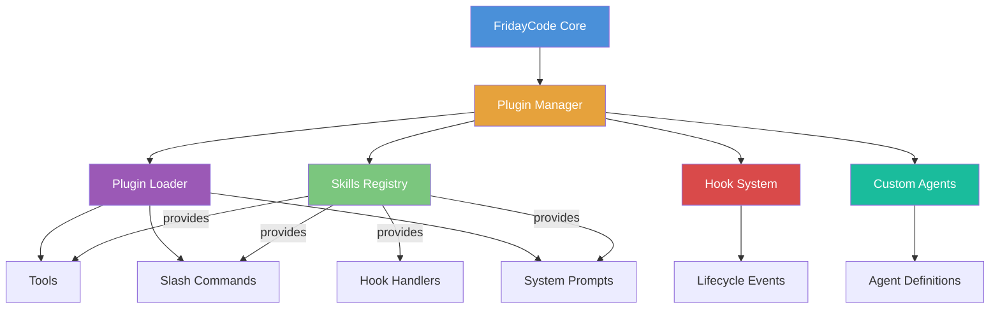
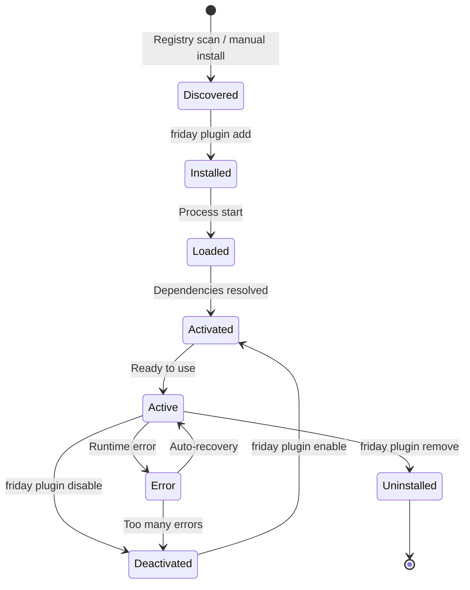
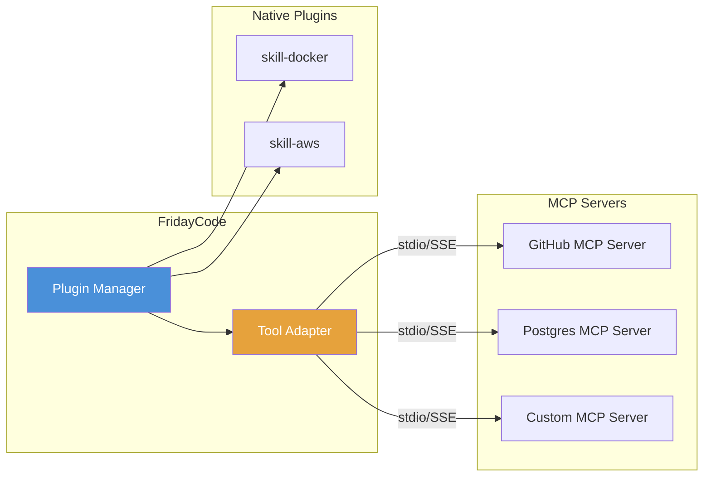
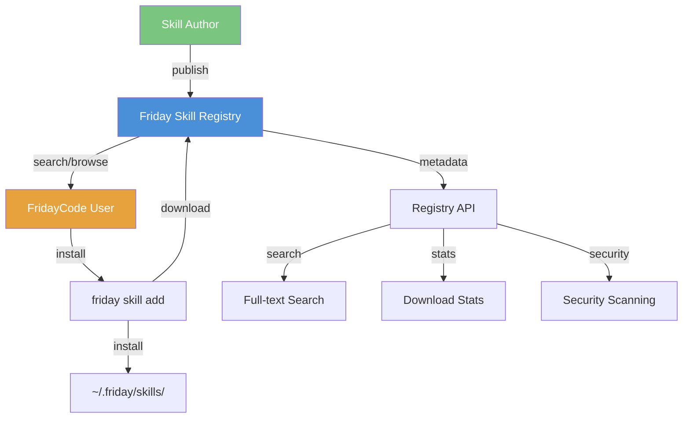

# Skills, Plugins, Hooks & Extensions System

> Design document for FridayCode's extensibility ecosystem.

## Overview

FridayCode provides a comprehensive plugin architecture that enables the community to extend the agent's capabilities. The system is built around four interconnected concepts:

| Concept           | Purpose                           | Example                                                |
| ----------------- | --------------------------------- | ------------------------------------------------------ |
| **Skills**        | Installable capability packages   | `@friday/skill-docker` — adds Docker tools and context |
| **Plugins**       | Lower-level extension mechanism   | Custom tool providers, command handlers                |
| **Hooks**         | Event-driven middleware/observers | Transform prompts, log tool usage, enforce policies    |
| **Custom Agents** | User-defined agent types          | A "DBA agent" with database-specific tools and prompts |



---

## Skills System

Skills are the primary way to extend FridayCode. A skill is a self-contained package that bundles tools, commands, prompts, and hooks together under a single installable unit.

### Skill Manifest

Every skill contains a `friday-skill.json` manifest:

```json
{
  "name": "@friday/skill-docker",
  "version": "1.2.0",
  "description": "Docker container management tools for FridayCode",
  "author": "fridaycode-community",
  "license": "MIT",
  "fridaycode": ">=0.5.0",
  "tools": [
    {
      "name": "docker_run",
      "description": "Run a Docker container with specified image and options",
      "inputSchema": {
        "type": "object",
        "properties": {
          "image": { "type": "string", "description": "Docker image to run" },
          "command": { "type": "string", "description": "Command to execute" },
          "ports": { "type": "array", "items": { "type": "string" } },
          "volumes": { "type": "array", "items": { "type": "string" } },
          "env": { "type": "object", "additionalProperties": { "type": "string" } }
        },
        "required": ["image"]
      }
    },
    {
      "name": "docker_ps",
      "description": "List running Docker containers"
    },
    {
      "name": "docker_logs",
      "description": "View logs from a Docker container",
      "inputSchema": {
        "type": "object",
        "properties": {
          "container": { "type": "string" },
          "tail": { "type": "number", "default": 100 }
        },
        "required": ["container"]
      }
    }
  ],
  "commands": [
    {
      "name": "/docker",
      "description": "Docker management shortcuts",
      "subcommands": ["up", "down", "logs", "ps"]
    }
  ],
  "systemPrompt": "You have access to Docker tools. When the user asks about containers, images, or Docker Compose, use the docker_* tools.",
  "permissions": ["shell:execute", "network:local", "filesystem:read"],
  "hooks": {
    "onSessionStart": "./hooks/check-docker.js"
  }
}
```

### Installation Sources

Skills can be installed from multiple sources:

```bash
# From npm registry
friday skill add @friday/skill-docker

# From a git repository
friday skill add github:user/friday-skill-kubernetes

# From a local directory (development)
friday skill add ./my-custom-skill

# From a tarball URL
friday skill add https://example.com/skills/my-skill-1.0.0.tgz
```

### Installed Skills Location

```
~/.friday/
├── skills/
│   ├── @friday/
│   │   ├── skill-docker/
│   │   │   ├── friday-skill.json
│   │   │   ├── tools/
│   │   │   ├── hooks/
│   │   │   └── node_modules/
│   │   └── skill-aws/
│   └── @community/
│       └── skill-terraform/
├── skills.lock.json          # Locked versions
└── config.json               # Global configuration
```

### Skill Management Commands

```bash
# List installed skills
friday skill list

# Search available skills
friday skill search docker

# Install a skill
friday skill add @friday/skill-docker

# Update a skill
friday skill update @friday/skill-docker

# Remove a skill
friday skill remove @friday/skill-docker

# View skill info
friday skill info @friday/skill-docker

# Enable/disable without uninstalling
friday skill enable @friday/skill-docker
friday skill disable @friday/skill-docker
```

### Example Skills

| Skill                        | Description                      | Tools Provided                                            |
| ---------------------------- | -------------------------------- | --------------------------------------------------------- |
| `@friday/skill-docker`       | Docker container management      | `docker_run`, `docker_ps`, `docker_logs`, `docker_build`  |
| `@friday/skill-aws`          | AWS service interaction          | `aws_s3`, `aws_lambda`, `aws_ecs`, `aws_cloudwatch`       |
| `@friday/skill-database`     | Database querying and management | `db_query`, `db_schema`, `db_migrate`, `db_seed`          |
| `@friday/skill-kubernetes`   | Kubernetes cluster management    | `k8s_pods`, `k8s_deploy`, `k8s_logs`, `k8s_scale`         |
| `@friday/skill-figma`        | Figma design integration         | `figma_inspect`, `figma_export`, `figma_tokens`           |
| `@friday/skill-testing`      | Advanced test generation         | `test_generate`, `test_coverage`, `test_mutate`           |
| `@friday/skill-git-advanced` | Advanced Git workflows           | `git_bisect`, `git_rebase_interactive`, `git_cherry_pick` |
| `@friday/skill-performance`  | Performance profiling            | `perf_profile`, `perf_flamegraph`, `perf_benchmark`       |

---

## Plugin Architecture

Plugins are the foundational extension mechanism. Skills are built on top of the plugin system.

### Plugin Lifecycle



### Plugin API Surface

```typescript
// ── plugin-api.ts ─────────────────────────────────────────

import type { Tool, Command, HookHandler, EventType } from '@fridaycode/core';

/**
 * The API surface available to plugins during activation.
 * This is the primary interface plugins use to extend FridayCode.
 */
export interface PluginAPI {
  /**
   * Register a new tool that the agent can use.
   *
   * @example
   * api.registerTool({
   *   name: 'my_tool',
   *   description: 'Does something useful',
   *   inputSchema: { type: 'object', properties: { input: { type: 'string' } } },
   *   execute: async (params) => ({ result: `Processed: ${params.input}` }),
   * });
   */
  registerTool(tool: ToolDefinition): void;

  /**
   * Register a new slash command.
   *
   * @example
   * api.registerCommand({
   *   name: '/deploy',
   *   description: 'Deploy to staging or production',
   *   execute: async (args) => { ... },
   * });
   */
  registerCommand(command: CommandDefinition): void;

  /**
   * Add text to the system prompt. Appended after the base system prompt.
   *
   * @example
   * api.addSystemPrompt('You have access to Kubernetes tools. Use k8s_* tools for cluster management.');
   */
  addSystemPrompt(prompt: string): void;

  /**
   * Subscribe to lifecycle events (observer pattern — cannot modify data).
   *
   * @example
   * api.onEvent('toolExec', (event) => {
   *   console.log(`Tool ${event.toolName} executed in ${event.durationMs}ms`);
   * });
   */
  onEvent(event: EventType, handler: EventHandler): Disposable;

  /**
   * Register a hook that can modify data flowing through the pipeline.
   *
   * @example
   * api.registerHook('beforePrompt', async (prompt) => {
   *   return prompt + '\nAlways use TypeScript.';
   * });
   */
  registerHook<T extends HookType>(hook: T, handler: HookHandler<T>): Disposable;

  /**
   * Access the plugin's sandboxed storage.
   */
  getStorage(): PluginStorage;

  /**
   * Log messages visible in FridayCode's debug output.
   */
  getLogger(): PluginLogger;

  /**
   * Get the current workspace root path.
   */
  getWorkspaceRoot(): string;

  /**
   * Read configuration values for this plugin.
   */
  getConfig<T = unknown>(key: string, defaultValue?: T): T;
}
```

### Plugin Definition

```typescript
// ── plugin.ts ─────────────────────────────────────────────

export interface PluginDefinition {
  /** Unique plugin identifier */
  name: string;

  /** Semantic version */
  version: string;

  /** Human-readable description */
  description: string;

  /** Minimum FridayCode version required */
  fridaycode: string;

  /** Other plugins this plugin depends on */
  dependencies?: Record<string, string>;

  /**
   * Called when the plugin is activated.
   * Use the API to register tools, commands, hooks, etc.
   */
  activate(api: PluginAPI): Promise<void> | void;

  /**
   * Called when the plugin is deactivated.
   * Clean up any resources (timers, connections, etc.)
   */
  deactivate?(): Promise<void> | void;
}
```

### Plugin Implementation Example

```typescript
// ── @friday/skill-docker/src/index.ts ─────────────────────

import type { PluginDefinition, PluginAPI } from '@fridaycode/core';
import { execAsync } from './utils';

const dockerPlugin: PluginDefinition = {
  name: '@friday/skill-docker',
  version: '1.2.0',
  description: 'Docker container management tools',
  fridaycode: '>=0.5.0',

  activate(api: PluginAPI) {
    // Register tools
    api.registerTool({
      name: 'docker_ps',
      description: 'List running Docker containers',
      inputSchema: {
        type: 'object',
        properties: {
          all: {
            type: 'boolean',
            description: 'Show all containers (including stopped)',
            default: false,
          },
        },
      },
      execute: async (params) => {
        const flag = params.all ? '-a' : '';
        const output = await execAsync(
          `docker ps ${flag} --format "table {{.ID}}\\t{{.Image}}\\t{{.Status}}\\t{{.Names}}"`,
        );
        return { result: output };
      },
    });

    api.registerTool({
      name: 'docker_logs',
      description: 'View logs from a Docker container',
      inputSchema: {
        type: 'object',
        properties: {
          container: { type: 'string', description: 'Container name or ID' },
          tail: { type: 'number', description: 'Number of lines from end', default: 100 },
        },
        required: ['container'],
      },
      execute: async (params) => {
        const output = await execAsync(`docker logs --tail ${params.tail} ${params.container}`);
        return { result: output };
      },
    });

    // Register slash command
    api.registerCommand({
      name: '/docker',
      description: 'Docker management shortcuts',
      execute: async (args) => {
        const [subcommand, ...rest] = args.split(' ');
        switch (subcommand) {
          case 'up':
            return execAsync('docker compose up -d');
          case 'down':
            return execAsync('docker compose down');
          case 'logs':
            return execAsync(`docker compose logs --tail 50 ${rest.join(' ')}`);
          default:
            return 'Usage: /docker [up|down|logs|ps]';
        }
      },
    });

    // Add context to system prompt
    api.addSystemPrompt(
      'Docker tools are available. Use docker_ps, docker_logs, docker_run, and docker_build ' +
        'when the user needs to manage containers. The /docker command provides quick shortcuts.',
    );

    // Hook: check Docker availability on session start
    api.registerHook('onSessionStart', async () => {
      try {
        await execAsync('docker info --format "{{.ServerVersion}}"');
        api.getLogger().info('Docker daemon is running');
      } catch {
        api.getLogger().warn('Docker daemon is not running — Docker tools may not work');
      }
    });
  },
};

export default dockerPlugin;
```

### Sandboxing

Plugins run with restricted permissions to protect the host system:

| Permission           | Description                        | Default         |
| -------------------- | ---------------------------------- | --------------- |
| `filesystem:read`    | Read files within the workspace    | ✅ Granted      |
| `filesystem:write`   | Write files within the workspace   | ❌ Must request |
| `filesystem:outside` | Access files outside the workspace | ❌ Must request |
| `shell:execute`      | Execute shell commands             | ❌ Must request |
| `network:local`      | Access localhost/127.0.0.1         | ❌ Must request |
| `network:internet`   | Access external URLs               | ❌ Must request |
| `env:read`           | Read environment variables         | ❌ Must request |
| `secrets:read`       | Read secrets/credentials           | ❌ Must request |

```typescript
// Permission enforcement
export class PluginSandbox {
  private granted: Set<Permission>;

  constructor(permissions: Permission[]) {
    this.granted = new Set(permissions);
  }

  assertPermission(permission: Permission): void {
    if (!this.granted.has(permission)) {
      throw new PermissionDeniedError(
        `Plugin requires "${permission}" permission but it was not granted. ` +
          `Add "${permission}" to the plugin's permissions array in friday-skill.json.`,
      );
    }
  }

  wrapExec(fn: Function, requiredPermission: Permission): Function {
    return (...args: any[]) => {
      this.assertPermission(requiredPermission);
      return fn(...args);
    };
  }
}
```

---

## Hook System

Hooks provide an event-driven mechanism for observing and modifying FridayCode's behavior at key lifecycle points.

### Hook Types

There are two categories of hooks:

1. **Middleware hooks** — Can modify data flowing through the pipeline (transform pattern)
2. **Observer hooks** — Can only observe events, cannot modify data (event pattern)

### Available Hooks

| Hook              | Type       | Trigger Point                  | Data                                                                |
| ----------------- | ---------- | ------------------------------ | ------------------------------------------------------------------- |
| `beforePrompt`    | Middleware | Before sending prompt to LLM   | `{ prompt: string, messages: Message[] }`                           |
| `afterResponse`   | Middleware | After receiving LLM response   | `{ response: string, usage: TokenUsage }`                           |
| `beforeToolExec`  | Middleware | Before executing a tool        | `{ tool: string, params: object }`                                  |
| `afterToolExec`   | Observer   | After tool execution completes | `{ tool: string, params: object, result: any, durationMs: number }` |
| `onError`         | Observer   | When an error occurs           | `{ error: Error, context: string }`                                 |
| `onSessionStart`  | Observer   | When a new session begins      | `{ sessionId: string, cwd: string }`                                |
| `onSessionEnd`    | Observer   | When a session ends            | `{ sessionId: string, durationMs: number }`                         |
| `beforeFileWrite` | Middleware | Before writing/editing a file  | `{ path: string, content: string }`                                 |
| `afterFileWrite`  | Observer   | After a file is written        | `{ path: string, content: string }`                                 |
| `beforeCommit`    | Middleware | Before creating a git commit   | `{ message: string, files: string[] }`                              |
| `onAgentSpawn`    | Observer   | When a sub-agent is spawned    | `{ agentType: string, prompt: string }`                             |
| `onAgentComplete` | Observer   | When a sub-agent finishes      | `{ agentType: string, result: AgentResult }`                        |

### Hook Interfaces

```typescript
// ── hooks/types.ts ────────────────────────────────────────

/** Data payloads for each hook type */
export interface HookDataMap {
  beforePrompt: { prompt: string; messages: Message[] };
  afterResponse: { response: string; usage: TokenUsage };
  beforeToolExec: { tool: string; params: Record<string, unknown> };
  afterToolExec: {
    tool: string;
    params: Record<string, unknown>;
    result: unknown;
    durationMs: number;
  };
  onError: { error: Error; context: string };
  onSessionStart: { sessionId: string; cwd: string };
  onSessionEnd: { sessionId: string; durationMs: number };
  beforeFileWrite: { path: string; content: string };
  afterFileWrite: { path: string; content: string };
  beforeCommit: { message: string; files: string[] };
  onAgentSpawn: { agentType: string; prompt: string };
  onAgentComplete: { agentType: string; result: AgentResult };
}

/** Middleware hook — receives data, returns (possibly modified) data */
export type MiddlewareHook<T extends keyof HookDataMap> = (
  data: HookDataMap[T],
) => Promise<HookDataMap[T]> | HookDataMap[T];

/** Observer hook — receives data, returns nothing */
export type ObserverHook<T extends keyof HookDataMap> = (
  data: HookDataMap[T],
) => Promise<void> | void;

/** All middleware hook names */
export type MiddlewareHookName =
  | 'beforePrompt'
  | 'afterResponse'
  | 'beforeToolExec'
  | 'beforeFileWrite'
  | 'beforeCommit';

/** All observer hook names */
export type ObserverHookName =
  | 'afterToolExec'
  | 'onError'
  | 'onSessionStart'
  | 'onSessionEnd'
  | 'afterFileWrite'
  | 'onAgentSpawn'
  | 'onAgentComplete';

/** Hook handler — type depends on whether it's middleware or observer */
export type HookHandler<T extends keyof HookDataMap> = T extends MiddlewareHookName
  ? MiddlewareHook<T>
  : ObserverHook<T>;
```

### Hook Registry

```typescript
// ── hooks/registry.ts ─────────────────────────────────────

export class HookRegistry {
  private middlewareHooks: Map<string, MiddlewareHook<any>[]> = new Map();
  private observerHooks: Map<string, ObserverHook<any>[]> = new Map();

  /**
   * Register a middleware hook that can transform data.
   */
  registerMiddleware<T extends MiddlewareHookName>(
    hook: T,
    handler: MiddlewareHook<T>,
    priority: number = 100,
  ): Disposable {
    const handlers = this.middlewareHooks.get(hook) ?? [];
    handlers.push(handler);
    // Sort by priority (lower = earlier)
    handlers.sort((a, b) => (a as any)._priority - (b as any)._priority);
    this.middlewareHooks.set(hook, handlers);

    return { dispose: () => this.remove(hook, handler) };
  }

  /**
   * Register an observer hook that cannot modify data.
   */
  registerObserver<T extends ObserverHookName>(hook: T, handler: ObserverHook<T>): Disposable {
    const handlers = this.observerHooks.get(hook) ?? [];
    handlers.push(handler);
    this.observerHooks.set(hook, handlers);

    return { dispose: () => this.remove(hook, handler) };
  }

  /**
   * Execute middleware hooks in sequence, passing data through each handler.
   * Returns the (possibly transformed) data.
   */
  async executeMiddleware<T extends MiddlewareHookName>(
    hook: T,
    data: HookDataMap[T],
  ): Promise<HookDataMap[T]> {
    const handlers = this.middlewareHooks.get(hook) ?? [];
    let current = data;

    for (const handler of handlers) {
      try {
        current = await handler(current);
      } catch (error) {
        this.handleHookError(hook, error);
      }
    }

    return current;
  }

  /**
   * Emit an observer event to all registered handlers.
   * Handlers run concurrently and cannot modify data.
   */
  async emitObserver<T extends ObserverHookName>(hook: T, data: HookDataMap[T]): Promise<void> {
    const handlers = this.observerHooks.get(hook) ?? [];

    await Promise.allSettled(
      handlers.map((handler) =>
        Promise.resolve(handler(data)).catch((error) => this.handleHookError(hook, error)),
      ),
    );
  }

  private remove(hook: string, handler: Function): void {
    for (const map of [this.middlewareHooks, this.observerHooks]) {
      const handlers = map.get(hook);
      if (handlers) {
        const index = handlers.indexOf(handler as any);
        if (index !== -1) handlers.splice(index, 1);
      }
    }
  }

  private handleHookError(hook: string, error: unknown): void {
    console.error(`[Hook Error] ${hook}:`, error);
    // Observer errors are swallowed; middleware errors skip the handler
  }
}
```

### Project-Level Hooks

Users can define project-specific hooks in the `.friday/hooks/` directory:

```
.friday/
├── hooks/
│   ├── before-prompt.ts        # Middleware: modify prompts
│   ├── after-tool-exec.ts      # Observer: log tool usage
│   ├── before-commit.ts        # Middleware: enforce commit conventions
│   └── on-session-start.ts     # Observer: load project context
└── config.json
```

**Example: Enforce conventional commits**

```typescript
// .friday/hooks/before-commit.ts
import type { HookDataMap } from '@fridaycode/core';

export default async function beforeCommit(
  data: HookDataMap['beforeCommit'],
): Promise<HookDataMap['beforeCommit']> {
  const pattern = /^(feat|fix|docs|style|refactor|perf|test|chore)(\(.+\))?: .{1,72}$/;

  if (!pattern.test(data.message)) {
    // Rewrite the commit message to follow conventional commits
    const type = inferCommitType(data.files);
    data.message = `${type}: ${data.message}`;
  }

  return data;
}

function inferCommitType(files: string[]): string {
  if (files.some((f) => f.includes('.test.'))) return 'test';
  if (files.some((f) => f.includes('/docs/'))) return 'docs';
  if (files.every((f) => f.endsWith('.md'))) return 'docs';
  return 'feat';
}
```

**Example: Add project context to every prompt**

```typescript
// .friday/hooks/before-prompt.ts
import { readFile } from 'fs/promises';
import type { HookDataMap } from '@fridaycode/core';

export default async function beforePrompt(
  data: HookDataMap['beforePrompt'],
): Promise<HookDataMap['beforePrompt']> {
  try {
    const context = await readFile('.friday/CONTEXT.md', 'utf-8');
    data.prompt = `${context}\n\n---\n\n${data.prompt}`;
  } catch {
    // No context file — that's fine
  }

  return data;
}
```

---

## Custom Agents

Users can define custom agent types that combine a specific model, system prompt, tool set, and configuration.

### Agent Definition Format

Custom agents are defined as YAML or JSON files in `.friday/agents/`:

```yaml
# .friday/agents/dba.yaml
name: dba
displayName: Database Administrator Agent
description: Specialized agent for database operations, query optimization, and schema design

model: claude-sonnet-4.5
temperature: 0.2
maxTokens: 8192

systemPrompt: |
  You are a senior Database Administrator. Your expertise includes:
  - SQL query optimization and analysis
  - Schema design and normalization
  - Migration planning and execution
  - Index strategy and performance tuning
  - Data integrity and backup strategies

  Always explain your reasoning. When suggesting schema changes,
  provide both the migration SQL and a rollback plan.

tools:
  - bash
  - view
  - edit
  - grep
  - glob
  - db_query # From @friday/skill-database
  - db_schema
  - db_migrate

restrictions:
  readOnly: false
  allowedPaths:
    - 'src/database/**'
    - 'migrations/**'
    - 'prisma/**'
    - 'drizzle/**'
  blockedCommands:
    - 'rm -rf'
    - 'DROP DATABASE'
```

```yaml
# .friday/agents/security-reviewer.yaml
name: security-reviewer
displayName: Security Review Agent
description: Reviews code changes for security vulnerabilities

model: claude-sonnet-4
temperature: 0.1
maxTokens: 4096

systemPrompt: |
  You are a security-focused code reviewer. Analyze code for:
  - Injection vulnerabilities (SQL, XSS, command injection)
  - Authentication and authorization flaws
  - Sensitive data exposure
  - Insecure dependencies
  - OWASP Top 10 issues

  Rate each finding: CRITICAL, HIGH, MEDIUM, LOW.
  Only report genuine security issues — no false positives.

tools:
  - bash
  - view
  - grep
  - glob

restrictions:
  readOnly: true
```

### Using Custom Agents

```bash
# Use in interactive mode
friday agent dba "Optimize the user search query that's timing out"

# Use via slash command
/agent dba Analyze the slow queries in the application log

# List available custom agents
friday agent list
```

### Custom Agent TypeScript Interface

```typescript
// ── custom-agents/types.ts ────────────────────────────────

export interface CustomAgentDefinition {
  /** Unique agent name (kebab-case) */
  name: string;

  /** Display name for UI */
  displayName: string;

  /** What this agent specializes in */
  description: string;

  /** LLM model to use */
  model: string;

  /** Temperature for generation (0.0-1.0) */
  temperature?: number;

  /** Maximum output tokens */
  maxTokens?: number;

  /** System prompt defining the agent's persona and expertise */
  systemPrompt: string;

  /** List of tool names available to this agent */
  tools: string[];

  /** Optional restrictions on agent behavior */
  restrictions?: {
    /** If true, agent cannot modify files */
    readOnly?: boolean;
    /** Glob patterns for allowed file paths */
    allowedPaths?: string[];
    /** Shell commands that are blocked */
    blockedCommands?: string[];
  };
}

export class CustomAgentLoader {
  private agentsDir: string;

  constructor(workspaceRoot: string) {
    this.agentsDir = path.join(workspaceRoot, '.friday', 'agents');
  }

  async loadAll(): Promise<CustomAgentDefinition[]> {
    const files = await glob('*.{yaml,yml,json}', { cwd: this.agentsDir });
    return Promise.all(files.map((f) => this.loadOne(f)));
  }

  async loadOne(filename: string): Promise<CustomAgentDefinition> {
    const content = await readFile(path.join(this.agentsDir, filename), 'utf-8');
    const ext = path.extname(filename);

    const definition = ext === '.json' ? JSON.parse(content) : parseYAML(content);

    return validateAgentDefinition(definition);
  }
}
```

---

## MCP Integration

[Model Context Protocol (MCP)](https://modelcontextprotocol.io) servers act as a special class of plugin in FridayCode, providing tools through a standardized protocol.

### How MCP Servers Relate to Plugins



### MCP Configuration

MCP servers are configured in `.friday/mcp-config.json` or `~/.friday/mcp-config.json`:

```json
{
  "mcpServers": {
    "github": {
      "command": "npx",
      "args": ["-y", "@modelcontextprotocol/server-github"],
      "env": {
        "GITHUB_PERSONAL_ACCESS_TOKEN": "${GITHUB_TOKEN}"
      }
    },
    "postgres": {
      "command": "npx",
      "args": ["-y", "@modelcontextprotocol/server-postgres"],
      "env": {
        "DATABASE_URL": "${DATABASE_URL}"
      }
    },
    "custom-api": {
      "url": "http://localhost:3001/mcp",
      "transport": "sse"
    }
  }
}
```

### MCP Adapter

```typescript
// ── mcp/adapter.ts ────────────────────────────────────────

import { Client } from '@modelcontextprotocol/sdk/client/index.js';
import type { ToolDefinition } from '@fridaycode/core';

export class MCPAdapter {
  private clients: Map<string, Client> = new Map();

  /**
   * Connect to an MCP server and register its tools.
   */
  async connect(name: string, config: MCPServerConfig, pluginAPI: PluginAPI): Promise<void> {
    const client = new Client({ name: `fridaycode-${name}`, version: '1.0.0' });

    // Connect via stdio or SSE transport
    if (config.command) {
      await client.connect(new StdioTransport(config.command, config.args, config.env));
    } else if (config.url) {
      await client.connect(new SSETransport(config.url));
    }

    this.clients.set(name, client);

    // Discover and register all tools from the MCP server
    const { tools } = await client.listTools();

    for (const tool of tools) {
      pluginAPI.registerTool({
        name: `${name}_${tool.name}`,
        description: tool.description ?? '',
        inputSchema: tool.inputSchema,
        execute: async (params) => {
          const result = await client.callTool({ name: tool.name, arguments: params });
          return { result: result.content };
        },
      });
    }
  }

  async disconnect(name: string): Promise<void> {
    const client = this.clients.get(name);
    if (client) {
      await client.close();
      this.clients.delete(name);
    }
  }

  async disconnectAll(): Promise<void> {
    await Promise.all(Array.from(this.clients.keys()).map((name) => this.disconnect(name)));
  }
}
```

---

## Security Model

### Permission Scoping

Every plugin/skill declares the permissions it needs. Users are prompted to approve permissions on first activation:

```
┌──────────────────────────────────────────────────────────┐
│  @friday/skill-docker requests the following permissions: │
│                                                          │
│  ✅ filesystem:read    — Read files in your workspace    │
│  ⚠️  shell:execute     — Run shell commands              │
│  ⚠️  network:local     — Access local network services   │
│                                                          │
│  [Allow]  [Allow Once]  [Deny]  [View Source]            │
└──────────────────────────────────────────────────────────┘
```

### Audit Trail

All plugin actions are logged for security auditing:

```typescript
export interface AuditEntry {
  timestamp: string;
  plugin: string;
  action: 'tool_call' | 'file_read' | 'file_write' | 'shell_exec' | 'network_request';
  details: {
    tool?: string;
    path?: string;
    command?: string;
    url?: string;
  };
  permitted: boolean;
}

export class AuditLogger {
  private entries: AuditEntry[] = [];
  private logFile: string;

  constructor(workspaceRoot: string) {
    this.logFile = path.join(workspaceRoot, '.friday', 'audit.log');
  }

  log(entry: Omit<AuditEntry, 'timestamp'>): void {
    const full: AuditEntry = { ...entry, timestamp: new Date().toISOString() };
    this.entries.push(full);
    appendFile(this.logFile, JSON.stringify(full) + '\n');
  }

  query(filter: Partial<AuditEntry>): AuditEntry[] {
    return this.entries.filter((entry) =>
      Object.entries(filter).every(([key, value]) => entry[key as keyof AuditEntry] === value),
    );
  }
}
```

### Security Boundaries

```
┌─────────────────────────────────────────────────────┐
│                   Host System                       │
│  ┌───────────────────────────────────────────────┐  │
│  │              FridayCode Process                │  │
│  │  ┌─────────────────────────────────────────┐  │  │
│  │  │           Plugin Sandbox                 │  │  │
│  │  │                                          │  │  │
│  │  │  • Cannot access host filesystem         │  │  │
│  │  │    outside workspace (without permission) │  │  │
│  │  │  • Cannot make network requests           │  │  │
│  │  │    (without permission)                   │  │  │
│  │  │  • Cannot read environment variables      │  │  │
│  │  │    (without permission)                   │  │  │
│  │  │  • Cannot spawn processes                 │  │  │
│  │  │    (without permission)                   │  │  │
│  │  │  • All actions logged to audit trail      │  │  │
│  │  │                                          │  │  │
│  │  └─────────────────────────────────────────┘  │  │
│  └───────────────────────────────────────────────┘  │
└─────────────────────────────────────────────────────┘
```

---

## Skill Registry

A future npm-like registry for discovering and sharing FridayCode skills.

### Registry Architecture



### Registry API

```
GET  /api/v1/skills?q=docker&page=1&limit=20    # Search skills
GET  /api/v1/skills/@friday/skill-docker          # Get skill metadata
GET  /api/v1/skills/@friday/skill-docker/versions  # List versions
POST /api/v1/skills                               # Publish a skill
GET  /api/v1/categories                           # Browse categories
GET  /api/v1/featured                             # Featured/popular skills
```

### Publishing a Skill

```bash
# Authenticate with the registry
friday registry login

# Validate the skill manifest
friday skill validate

# Publish to the registry
friday skill publish

# Publish a scoped skill
friday skill publish --scope @myorg
```

### Registry Skill Metadata

```typescript
export interface RegistrySkillMetadata {
  name: string;
  version: string;
  description: string;
  author: {
    name: string;
    url?: string;
  };
  license: string;
  repository?: string;
  downloads: {
    weekly: number;
    total: number;
  };
  rating: {
    average: number;
    count: number;
  };
  tags: string[];
  permissions: string[];
  fridaycodeVersion: string;
  publishedAt: string;
  securityAudit: {
    passed: boolean;
    lastAuditedAt: string;
    findings: SecurityFinding[];
  };
}
```

---

## Complete Type Definitions

### Tool Definition

```typescript
export interface ToolDefinition {
  /** Unique tool name (snake_case) */
  name: string;

  /** Human-readable description for the LLM */
  description: string;

  /** JSON Schema for tool parameters */
  inputSchema?: JSONSchema;

  /** Tool implementation */
  execute(params: Record<string, unknown>): Promise<ToolResult>;
}

export interface ToolResult {
  /** The result content to return to the LLM */
  result: string | object;

  /** If true, the result is an error message */
  isError?: boolean;
}
```

### Command Definition

```typescript
export interface CommandDefinition {
  /** Slash command name (e.g., "/deploy") */
  name: string;

  /** Description shown in command list */
  description: string;

  /** Subcommands, if any */
  subcommands?: string[];

  /** Command implementation */
  execute(args: string): Promise<string | void>;

  /** Tab completion handler */
  complete?(partial: string): Promise<string[]>;
}
```

### Disposable Pattern

```typescript
export interface Disposable {
  dispose(): void;
}
```

### Plugin Storage

```typescript
export interface PluginStorage {
  get<T = unknown>(key: string): Promise<T | undefined>;
  set<T = unknown>(key: string, value: T): Promise<void>;
  delete(key: string): Promise<void>;
  clear(): Promise<void>;
  keys(): Promise<string[]>;
}
```

### Plugin Logger

```typescript
export interface PluginLogger {
  debug(message: string, ...args: unknown[]): void;
  info(message: string, ...args: unknown[]): void;
  warn(message: string, ...args: unknown[]): void;
  error(message: string, ...args: unknown[]): void;
}
```

---

## Configuration Reference

### Global Config (`~/.friday/config.json`)

```json
{
  "skills": {
    "autoUpdate": true,
    "registryUrl": "https://registry.fridaycode.dev",
    "trustedScopes": ["@friday", "@myorg"]
  },
  "plugins": {
    "maxLoadTimeMs": 5000,
    "errorThreshold": 3
  },
  "hooks": {
    "timeout": 10000,
    "continueOnError": true
  },
  "security": {
    "auditLog": true,
    "promptForPermissions": true,
    "blockedPermissions": []
  }
}
```

### Project Config (`.friday/config.json`)

```json
{
  "skills": ["@friday/skill-docker", "@friday/skill-database"],
  "hooks": {
    "beforeCommit": "./hooks/before-commit.ts",
    "beforePrompt": "./hooks/before-prompt.ts"
  },
  "agents": {
    "dba": "./.friday/agents/dba.yaml",
    "security-reviewer": "./.friday/agents/security-reviewer.yaml"
  }
}
```

---

## Future Considerations

- **Skill composition** — Skills that depend on and extend other skills
- **Shared state between hooks** — A hook context object that persists across hooks in the same lifecycle event
- **Visual skill builder** — A GUI for creating skills without writing code
- **Skill marketplace** — A web-based marketplace for browsing, rating, and installing skills
- **Runtime skill loading** — Install and activate skills mid-session without restart
- **Skill sandboxing via WASM** — Run plugin code in WebAssembly for stronger isolation
- **Inter-plugin communication** — A message bus for plugins to communicate safely
- **Telemetry API** — Let plugins report metrics that users can view in a dashboard
